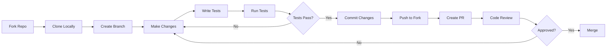

# Contributing to Voice Agent 🤝

Thank you for your interest in contributing to the Voice Agent project! This document provides guidelines and instructions for contributing.

## Table of Contents
- [Code of Conduct](#code-of-conduct)
- [Getting Started](#getting-started)
- [Development Setup](#development-setup)
- [How to Contribute](#how-to-contribute)
- [Coding Standards](#coding-standards)
- [Testing Guidelines](#testing-guidelines)
- [Pull Request Process](#pull-request-process)

## Code of Conduct

By participating in this project, you agree to maintain a respectful and inclusive environment for everyone. Please:
- Be respectful and considerate in your communications
- Welcome newcomers and help them learn
- Focus on constructive feedback
- Respect differing viewpoints and experiences

## Getting Started

1. **Fork the repository** on GitHub
2. **Clone your fork** locally:
   ```bash
   git clone https://github.com/YOUR_USERNAME/Voice_Agent.git
   cd Voice_Agent
   ```
3. **Add upstream remote**:
   ```bash
   git remote add upstream https://github.com/ALTAMASH3322/Voice_Agent.git
   ```

## Development Setup

1. Create a virtual environment:
   ```bash
   python -m venv venv
   source venv/bin/activate  # On Windows: venv\Scripts\activate
   ```

2. Install dependencies:
   ```bash
   pip install -r requirements.txt
   pip install -r requirements-dev.txt  # If available
   ```

3. Set up pre-commit hooks (if configured):
   ```bash
   pre-commit install
   ```

4. Create your `.env` file:
   ```bash
   cp .env.example .env
   # Edit .env with your API keys
   ```

## How to Contribute

### Reporting Bugs 🐛

When reporting bugs, please include:
- A clear and descriptive title
- Steps to reproduce the issue
- Expected behavior vs. actual behavior
- Your environment (OS, Python version, etc.)
- Relevant logs or error messages
- Screenshots if applicable

### Suggesting Enhancements 💡

For feature requests:
- Use a clear and descriptive title
- Provide detailed description of the proposed feature
- Explain why this feature would be useful
- Include examples of how it would work

### Code Contributions 💻

1. **Create a branch** for your work:
   ```bash
   git checkout -b feature/your-feature-name
   ```

2. **Make your changes** following our coding standards

3. **Write or update tests** for your changes

4. **Run the test suite**:
   ```bash
   pytest tests/
   ```

5. **Commit your changes** with clear messages:
   ```bash
   git commit -m "Add feature: brief description"
   ```

6. **Push to your fork**:
   ```bash
   git push origin feature/your-feature-name
   ```

7. **Create a Pull Request** on GitHub

## Coding Standards

### Python Style Guide

We follow PEP 8 with some modifications:
- Line length: 88 characters (Black default)
- Use type hints for function signatures
- Use docstrings for all public functions/classes

### Code Formatting

We use **Black** for code formatting:
```bash
black .
```

### Linting

We use **Flake8** for linting:
```bash
flake8 voice_agent/ tests/
```

### Type Checking

We use **mypy** for static type checking:
```bash
mypy voice_agent/
```

### Example Code Style

```python
from typing import Optional, List, Dict
import asyncio


class VoiceAgent:
    """
    A voice agent that processes speech and generates responses.
    
    Args:
        language: The language code (e.g., 'en-US')
        model: The LLM model to use
        
    Example:
        >>> agent = VoiceAgent(language='en-US')
        >>> agent.process('Hello')
        'Hi there! How can I help you?'
    """
    
    def __init__(self, language: str = "en-US", model: str = "gpt-4"):
        self.language = language
        self.model = model
        self._history: List[Dict[str, str]] = []
    
    def process(self, text: str) -> Optional[str]:
        """
        Process user input and generate a response.
        
        Args:
            text: The user's input text
            
        Returns:
            The agent's response, or None if processing fails
        """
        if not text.strip():
            return None
        
        # Process the text
        response = self._generate_response(text)
        return response
    
    def _generate_response(self, text: str) -> str:
        """Generate a response (private method)."""
        # Implementation here
        pass
```

## Testing Guidelines

### Writing Tests

- Write tests for all new features
- Maintain test coverage above 80%
- Use descriptive test names
- Follow the Arrange-Act-Assert pattern

### Test Structure

```python
import pytest
from voice_agent import VoiceAgent


class TestVoiceAgent:
    """Tests for the VoiceAgent class."""
    
    def test_initialization(self):
        """Test that VoiceAgent initializes correctly."""
        # Arrange
        language = "en-US"
        
        # Act
        agent = VoiceAgent(language=language)
        
        # Assert
        assert agent.language == language
    
    def test_process_empty_input(self):
        """Test that empty input is handled correctly."""
        # Arrange
        agent = VoiceAgent()
        
        # Act
        result = agent.process("")
        
        # Assert
        assert result is None
```

### Running Tests

```bash
# Run all tests
pytest

# Run with coverage
pytest --cov=voice_agent tests/

# Run specific test file
pytest tests/test_voice_agent.py

# Run with verbose output
pytest -v

# Run specific test
pytest tests/test_voice_agent.py::TestVoiceAgent::test_initialization
```

## Pull Request Process

1. **Update documentation** if you've changed APIs or added features

2. **Update the CHANGELOG** (if it exists) with your changes

3. **Ensure all tests pass**:
   ```bash
   pytest tests/
   ```

4. **Run code quality checks**:
   ```bash
   black .
   flake8 .
   mypy voice_agent/
   ```

5. **Fill out the PR template** completely:
   - Description of changes
   - Related issues
   - Type of change (bugfix, feature, etc.)
   - Testing done
   - Screenshots (if applicable)

6. **Request review** from maintainers

7. **Address review feedback** promptly

8. **Squash commits** if requested before merging

### PR Title Format

Use conventional commits format:
- `feat: add streaming response support`
- `fix: resolve audio playback issue`
- `docs: update installation instructions`
- `test: add tests for voice profiles`
- `refactor: simplify audio processing pipeline`

## Areas for Contribution

We especially welcome contributions in:

### High Priority
- 🎯 Additional language support
- 🎯 Performance optimizations
- 🎯 Better error handling
- 🎯 Documentation improvements

### Medium Priority
- 📝 More usage examples
- 📝 Integration with other services
- 📝 UI/UX improvements
- 📝 Additional voice profiles

### Low Priority
- 🔧 Code refactoring
- 🔧 Test coverage improvements
- 🔧 CI/CD enhancements

## Development Workflow



## Questions?

If you have questions:
- Check existing [Issues](https://github.com/ALTAMASH3322/Voice_Agent/issues)
- Create a new issue with the `question` label
- Reach out to maintainers

## Recognition

Contributors will be recognized in:
- README.md contributors section
- Release notes
- Project documentation

Thank you for contributing! 🎉
